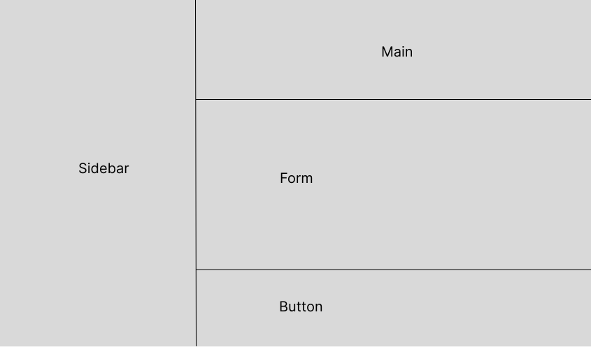

# Form-Validation
A form validation project to showcase knowledge on the use of HTML forms. This is part of the Brainnest Advanced Front-End Development Training

The live site can be found [here](https://jtm2021.github.io/Form-Validation/).

## Wireframe
The wireframe for the project was made using [Figma](https://www.figma.com/).

Click To See Wireframe

### Homepage

## Typography

The project used Roboto and Fredericka fonts from [Google Fonts](https://fonts.google.com/).

## Images

The images used in the project were taken from [Pexels](https://www.pexels.com/).

The logo was taken from [Pngfind](https://www.pngfind.com/download/hhhRobi_australian-australia-tourism-cartoon-free-photo-png-cartoon/)

## Contributors

    1. Jesson Mangilisan
    2. Valter Carvalho
    3. Oluwagbemi Oluwasakin